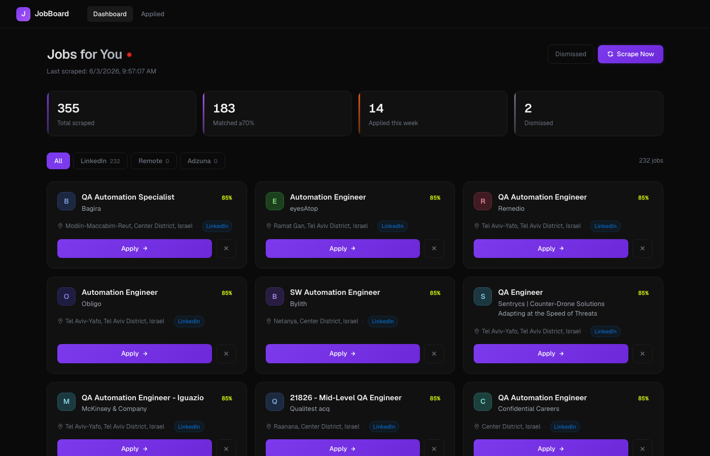

# Job Dashboard

A personal job dashboard for QA automation and entry-level software engineering roles. It scrapes Adzuna daily for jobs in Israel and remote, scores each listing against your skills profile using a weighted algorithm, and surfaces only matches above 70%. Click Apply to open the job in a new tab with your contact details already copied to clipboard. A daily email digest keeps you updated on new matches, and a dedicated view tracks every job you've applied to.

## Prerequisites

- Node.js 18 or newer
- A free Adzuna developer account — register at https://developer.adzuna.com
- A Gmail account with App Passwords enabled (for email notifications)

## Setup

1. **Clone or download** this repository into a local folder.

2. **Copy the env file** and fill in your credentials:
   ```bash
   cp .env.example server/.env
   ```
   Open `server/.env` and fill in every value (see comments in `.env.example`).

3. **Get your Adzuna credentials:**
   - Go to https://developer.adzuna.com and create a free account
   - Create a new application to receive your `App ID` and `App Key`
   - Paste them into `ADZUNA_APP_ID` and `ADZUNA_APP_KEY` in `server/.env`

4. **Generate a Gmail App Password** (required for email notifications):
   - Go to your Google Account → Security → 2-Step Verification (must be enabled)
   - Scroll to "App passwords" → create one for "Mail"
   - Paste the 16-character password into `SMTP_PASS` in `server/.env`

5. **Place your CV** at `assets/cv.pdf` (replace the placeholder file).

6. **Edit your skills profile** in `profile.json` — update the skills list with your actual technologies and adjust weights (3 = core skill, 2 = solid, 1 = familiar).

7. **Install dependencies:**
   ```bash
   npm install
   cd server && npm install && cd ..
   cd client && npm install && cd ..
   ```

## Running

```bash
npm run dev
```

This starts both the API server (port 3001) and the React dashboard. Open http://localhost:5173 in your browser.

Click **Scrape Now** on first launch to fetch your first batch of jobs. The scraper will also run automatically every day at 8:00 AM.

## Screenshot


